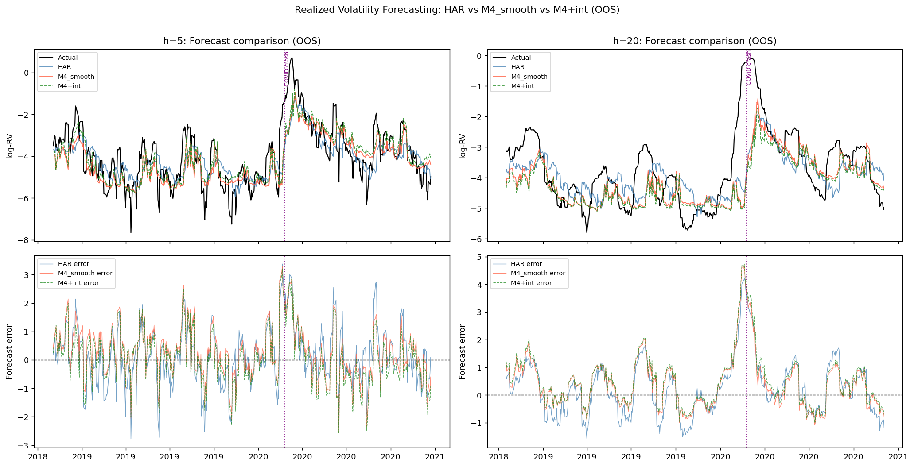
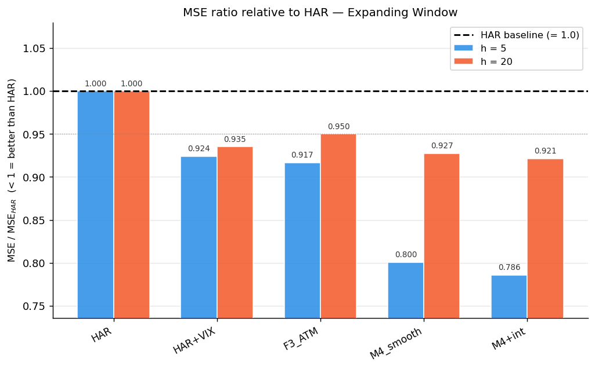
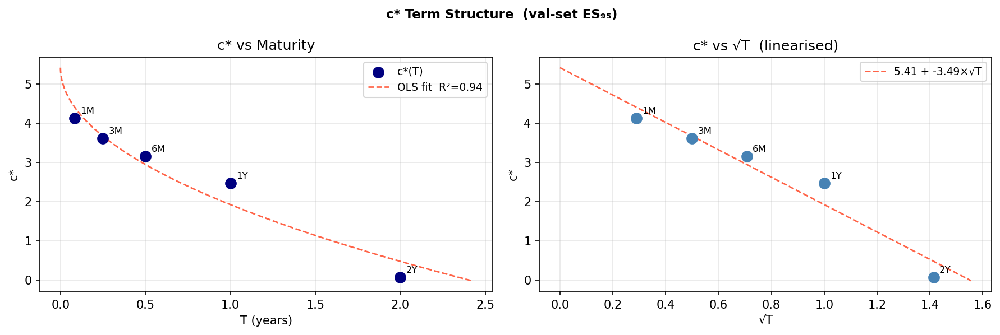

# SSVI Implied-Volatility Surface Dynamics & Realized-Volatility Forecasting
## Evidence from S&P 500 Options (2010–2020)

**Econometrics Project — Academic Year 2025/26**
Politecnico di Milano — Insurance & Econometrics
Authors: Alessio Porrini, Marco Amarilli, Camilla Introzzi, Christian Frigerio

---

**Abstract.** Using ~1.5 million filtered S&P 500 option quotes (2010–2020), we calibrate a daily arbitrage-free SSVI implied-volatility surface and ask whether its structural information improves the modelling and forecasting of its own parameters and of realized volatility (RV), relative to random-walk and HAR benchmarks. The central result is *negative with informational content*: a single asset's own option surface does not beat a parsimonious HAR for RV forecasting through the COVID-19 window, and the surface behaves as a near-efficiently-priced object at the daily frequency. We exercise the full course toolbox — panel regression with fixed/random effects and hypothesis testing, ARMA/ARMAX, VAR, non-stationarity and cointegration, and point/probabilistic forecasting — and add two original contributions: a deliberately asset-agnostic (VIX-free) RV-forecasting study (Notebook C) and an Avellaneda & Stoikov (2008) surface market-making risk engine with an SSVI-based, ES₉₅-calibrated residual add-on (Notebook D).

---

## 1. Introduction and Literature Review

**Research aims.** The project pursues two connected research questions:

- **RQ1 — Predictive content / market efficiency.** Does the structural information in an arbitrage-free IV surface carry incremental out-of-sample (OOS) predictive content for (a) its own future dynamics and (b) future realized volatility, beyond simple benchmarks (random walk, HAR)? A sharpened, deliberately asset-agnostic version asks whether a single underlying's *own* option surface can supply the regime information usually drawn from the VIX — specific to the S&P 500 — in a form portable to any asset with a liquid option market.
- **RQ2 — Risk-management application.** Can the **Avellaneda & Stoikov (2008)** optimal market-making framework, which sets quotes for a single instrument, be extended to the full implied-volatility surface with an SSVI-based residual-risk add-on calibrated to a target tail (Expected-Shortfall) coverage?

The first is the efficient-pricing question; the second turns the surface model into a deployable quoting-and-risk tool.

**Economic framework.** Under efficient option pricing the no-arbitrage IV surface should be close to a martingale at short horizons: if daily surface increments were systematically predictable, a delta-hedged position would extract near risk-free profit, which a functioning market arbitrages away. The competing hypothesis — from the long-memory and path-dependence literature — is that volatility (realized *and* implied) carries persistent, multi-horizon structure that low-order autoregressive models miss but a long-memory model can exploit.

**Literature.** The methodological backbone rests on three works. We parametrise the surface with the SSVI model of **Gatheral & Jacquier (2014)**, which guarantees freedom from static (butterfly and calendar) arbitrage. The forecasting backbone is the Heterogeneous Autoregressive (HAR) model of **Corsi (2009)**, which approximates the long memory of realized volatility — documented by **Andersen, Bollerslev, Diebold & Labys (2003)** — with cascaded daily/weekly/monthly components. The hypothesis that the IV surface is itself *path-dependent*, and hence amenable to HAR-type modelling, is the recent contribution of **Andrès, Boumezoued & Jourdain (2025)**, which directly motivates applying HAR to the SSVI parameters. For the risk engine we build on **Avellaneda & Stoikov (2008)**. Supporting tools: **Johansen (1991)** and **Engle & Granger (1987)** for cointegration, **Bollerslev (1986)** GARCH for conditional heteroskedasticity, and the **Diebold & Mariano (1995)** test (small-sample corrected) for formal forecast comparison.

---

## 2. Data and Methodology

### 2.1 Dataset (primary focus)

**Source and composition.** The raw dataset is a panel of daily **S&P 500 European option** quotes spanning 2010-01-01 → 2020-12-31 (~2,769 trading files; ~3.33 million raw rows), each carrying strike, option type, bid/ask/mid, open interest and time-to-expiry (TTE). Zero-coupon **Treasury rates** (1M, 3M, 6M, 1Y, 2Y, 3Y) and the **VIX** are pulled from FRED; the SPX spot is from Yahoo Finance. The data are processed in three notebooks (`00_data_preparation`, `01_iv_dataset_construction`, `02_ssvi_calibration`).

**Cleaning pipeline (core technique #1).** Quality filters remove illiquid and economically meaningless quotes — mid price > \$0.05, time-to-expiry > 7 days, relative bid-ask spread ≤ 30%, and log-moneyness ∈ [−0.40, 0.30]. The implied **forward** is extracted per maturity via put-call parity; Black-76 **implied volatility** is then computed by vectorised Newton-Raphson. At the calibration stage we apply a further **maturity-dependent delta filter**: far-OTM quotes whose absolute Black-Scholes delta falls below a band tightening from 0.30 at the shortest maturities to 0.05 at the longest ($\Delta_{\min}(T) = 0.05 + 0.25\,e^{-3T}$) are discarded, removing illiquid wings and keeping OTM puts and calls balanced before the arbitrage-free fit. The funnel is:

| Stage | Count |
|-------|-------|
| Raw rows | ~3,331,302 |
| After domain/liquidity filters | ~2,324,008 |
| Black-76 IV retained | ~1,500,012 |
| SSVI calibration success | 2,633 / 2,768 days (**95.1%**) |

**Derived parameter panel.** For each trading day we calibrate the SSVI surface, yielding a daily time series of the five parameters (α, β, ρ, η, γ). Calibration succeeds on **95.1%** of days with median RMSE_iv < 0.01 and **zero** calendar-arbitrage violations — this calibrated panel is the input to all downstream time-series analysis (Notebooks B and D). The realized-volatility target (Notebook C) is a daily log-RV proxy built from SPX returns.

### 2.2 SSVI parametrisation and parameter economics

$$\omega(k,\theta) = \frac{\theta}{2}\left\{1 + \rho\,\phi(\theta)\,k + \sqrt{(\phi(\theta)\,k+\rho)^2 + (1-\rho^2)}\right\}, \quad \phi(\theta) = \frac{\eta\,\theta^{-\gamma}}{1+\eta\,\theta^{1-\gamma}}$$

The five calibrated parameters carry direct economic readings (sample means in parentheses): **α** = log ATM variance / surface level (−3.45), **β** = term-structure slope (1.19), **ρ** = skew / leverage effect (−0.77), **η** = vol-of-vol / smile width (0.75), **γ** = term-structure decay rate (0.54).

### 2.3 Econometric toolbox — coverage of the core techniques

The project applies every core econometric technique of the course to the volatility data; the table maps each to its implementation. Section 3 mirrors this mapping, giving each method a self-contained results subsection (§3.1–§3.5), followed by the two original contributions (§3.6).

| # | Core technique | Implementation | Reported in |
|---|--------------------|----------------|-------------|
| 1 | Data cleaning, trend & seasonality | Cleaning funnel (NB 00–02); trend via I(d) classification + differencing; seasonality assessed and justified immaterial | §2.1, §3.1 |
| 2 | Linear regression + hypothesis testing | Panel IV regression with t/F-tests, RESET (NB A); OLS feature-significance pruning (NB C) | §3.2 |
| 3 | Fixed & random effects | Pooled OLS → Day FE → Day×Maturity FE → Surface-Cell FE, **Hausman test** FE-vs-RE (NB A) | §3.2 |
| 4 | ARMA models | BIC-optimal ARMA + **ARMAX** (exogenous VIX) on 10 series (NB B) | §3.4 |
| 5 | Point & probabilistic forecasting | Multi-horizon RV point forecasts + DM (NB C); **AR-GARCH 80% prediction intervals** (NB B); **ES₉₅ coverage** (NB D) | §3.5 |
| 6 | VAR models | VAR(2, BIC) on the 5-parameter system + **VECM** (NB B) | §3.4 |
| 7 | Non-stationarity & cointegration | ADF + KPSS, **Johansen** trace, **Engle-Granger**, rolling Johansen (NB B) | §3.3 |

**Evaluation metrics.** OOS skill is measured by $R^2_\text{OOS} = 1 - \sum_t (y_t-\hat y_t)^2 / \sum_t (y_t-y_{t-1})^2$ (relative to the naïve random-walk benchmark, so $R^2_\text{OOS}=0$ for the naïve model by construction), and pairwise comparison by a small-sample-corrected **Diebold-Mariano** test (Diebold & Mariano 1995; HAC Newey-West variance). Sign convention: **DM > 0 ⇒ model beats HAR; DM < 0 ⇒ model worse than HAR.**

---

## 3. Results

### 3.1 Data cleaning, trend and seasonality *(core technique #1)*

The cleaning funnel (§2.1) retains ~1.5M economically meaningful IV observations from ~3.3M raw rows and produces 2,633 arbitrage-free daily surfaces. **Trend / non-stationarity** is addressed formally in §3.3 (ADF/KPSS): the parameter *levels* are persistent (near-unit-root), so all autoregressive modelling is performed on the stationary **first differences**, and the slow-moving long-memory component is handled by the HAR aggregation (§3.6). **Seasonality:** daily SSVI parameters and log-RV exhibit no material deterministic calendar (e.g. day-of-week) seasonality at this frequency — the dominant low-frequency feature is long-memory persistence, not a periodic component. Where a standard technique is genuinely unsuitable for the data we justify its omission rather than forcing it; accordingly we treat a seasonal decomposition as inappropriate for this dataset and proceed with the persistence/long-memory framing instead.

### 3.2 Panel regression, fixed/random effects and hypothesis testing *(core techniques #2, #3)* — Notebook A

We regress Black-76 IV on option structural features (forward moneyness $k$, TTE, a bid-ask liquidity measure) across **~1.49 million** observations over 2,768 trading days, climbing a fixed-effects ladder. The within-transformation (time-demeaning) avoids an explicit ~2,768-column dummy matrix (≈31 GB in double precision).

| Specification | Fixed effects | R² |
|--------------|---------------|----|
| Pooled OLS | none | ~0.34 |
| Day FE | trading day | ~0.80 |
| Day + Maturity FE | day × maturity bucket | **0.86** |
| Surface-Cell FE | day × maturity × moneyness | **0.96** |

**Hypothesis testing.** Forward moneyness and TTE are the dominant, highly significant structural drivers of the IV cross-section. The **Hausman test** rejects random effects (p < 0.001) — fixed effects are the correct specification. The **RESET test** flags mild nonlinearity, which the log(IV) specification reduces. Gauss-Markov diagnostics reveal heteroskedasticity (expected with 1.5M quotes), so HAC standard errors are used throughout; the Jarque-Bera rejection of normality is practically immaterial at this sample size (verified via QQ plot). *Reading:* the surface's **shape** is almost fully explained by moneyness, maturity and day effects — SSVI supplies the geometry, not, as §3.5 shows, an incremental forecasting signal.

### 3.3 Non-stationarity and cointegration *(core technique #7)* — Notebook B

**Stationarity.** Each of the five parameter levels gives a *conflicting* ADF (rejects unit root) vs KPSS (rejects stationarity) verdict → classified "uncertain / borderline I(1)"; all five first differences are cleanly I(0). This justifies differencing before ARMA/VAR.

**Cointegration (α, η).** Testing the variance-level/vol-of-vol pair, the full-sample **Johansen** trace test returns **rank = 2** and **Engle-Granger** gives p = **0.0002\*\*\***. In a *bivariate* system rank = 2 is *full rank* — evidence that both series are individually (near-)stationary, not two I(1) series tied by a single long-run attractor (which would appear as rank = 1); the VECM is correspondingly weak OOS (α $R^2$ = +0.004, η $R^2$ = −0.018). A rolling Johansen (500-day windows) confirms the link is **regime-conditional** — rank = 1 in 30.0% of windows, rank = 2 in 67.2%, with the estimated rank tracking the VIX level — i.e. a structural feature of the SSVI parametrisation rather than a stable tradeable spread.

### 3.4 ARMA, ARMAX and VAR modelling *(core techniques #4, #6)* — Notebook B

**Data window.** 2,632 obs; train 2,105 / test 527 (chronological split).

**ARMA / ARMAX — order selection and residual diagnostics.** BIC over ARMA(p,q), $p,q\in\{0,1,2,3\}$, selects low orders throughout (levels: α→(1,0), β/ρ/γ→(1,1), η→(2,1); differences: (1,1) everywhere except d_γ→MA(1)). Each fitted ARMA is screened for the iid-residual assumption: a **Ljung-Box** test (lag 10) finds no remaining serial correlation for β, η, γ (levels) and for Δα, Δρ, Δη (differences), while α, ρ, Δβ, Δγ retain mild residual autocorrelation; **ARCH-LM** and **Jarque-Bera** reject homoskedastic and normal residuals throughout. We therefore report HAC standard errors and the AR-GARCH intervals of §3.5 rather than relying on Gaussian OLS inference.

**Levels.** The surface is essentially unforecastable: only γ beats the random walk (MSE-ratio **0.838**), α and β sit on it (0.998–1.000), and ρ, η are *worse* (1.03–1.13) — coefficient-estimation noise exceeds any exploitable signal.

**Differences.** Every model posts MSE-ratios of 0.32–0.53 against the naïve "tomorrow's change = today's change" baseline, but that apparent edge is mostly mechanical: the differenced parameters are negatively autocorrelated (−0.36 to −0.09), so a trivial expanding-mean forecast alone achieves 0.38–0.47, and ARMA, ARMAX and HAR all land within a whisker of it (§3.6). Adding exogenous regressors (ARMAX) changes nothing: despite train-set Granger significance of Δlog(VIX) and the SSVI fit-RMSE (p = 0.0001–0.005), ARMAX matches ARMA to the third decimal on every series.

**Surface-level evaluation (the binding test).** Recombining each model's parameter forecasts through the SSVI formula into the full surface (15 strikes × 5 maturities) and scoring next-day surface RMSE, *no model improves on the sticky (no-change) surface by more than 0.7%* — ARMA 0.9999×, VAR 0.9927×, best-per-parameter 1.0133× (worse than doing nothing). The parameter-space gains on the differences mostly predict the reversal of yesterday's calibration noise, which leaves no exploitable imprint on the surface a desk actually quotes — the efficient-surface fingerprint where it economically matters.

**VAR(2) + VECM (technique #6).** A BIC-optimal VAR(2) on the five-parameter system likewise fails to beat the random walk for four of five parameters; **only γ** attains a marginal OOS gain (MSE-ratio = **0.938**). Cross-parameter dynamics add essentially nothing at h = 1, consistent with the ARMA result.

### 3.5 Point and probabilistic forecasting *(core technique #5)* — Notebook C

**Design goal (the first original contribution).** This is the project's primary forecasting deliverable, and its design is deliberately asset-agnostic. VIX-type regime information is specific to the S&P 500 (the VIX is built from SPX options), so we ask whether a single underlying's *own* option surface — through SSVI levels, ATM IV, skew, and nonlinear stress interactions — can supply the same regime signal in a form **portable to any asset with a liquid option market**. The (non-portable) VIX-augmented HAR is the benchmark to beat; **F3_ATM** (HAR + log σ_ATM, requiring only the asset's own options) is the leading *portable* candidate; the M-series progressively adds nonlinear, option-implied stress features.

**Setup.** Target $y_t^{(h)} = \tfrac{1}{h}\sum_{i=1}^h \log\text{RV}_{t+i}$ for $h\in\{1,5,20\}$; train ~2,135 / test ~534 (the test window includes the COVID-19 shock, VIX ≈ 83). A key step (Section 6a) is collinearity control: uncentered λ-interactions reach **VIF = 3,738**, resolved by centering $\tilde\lambda_t=\lambda_t-\bar\lambda_\text{train}$; OLS significance then prunes the feature set. Single-split OOS performance:

| Model | Feat. | h=1 R²_OOS | h=5 R²_OOS | DM(h=5) | h=20 R²_OOS | DM(h=20) |
|-------|-------|------------|------------|---------|-------------|----------|
| Naive | RW | 0.000 | 0.000 | — | 0.000 | — |
| **HAR** | 3 | **0.466** | **0.846** | — | **0.857** | — |
| HAR+VIX | 4 | 0.488 | 0.832 | −0.58 | 0.864 | +0.52 |
| F3_ATM | 4 | 0.465 | 0.840 | −2.47** | 0.846 | −1.87* |
| HAR_rhoJ | 4 | 0.465 | 0.846 | −0.72 | 0.857 | −0.38 |
| M1 | 4 | 0.466 | 0.842 | −2.51** | 0.849 | −1.93* |
| M4_smooth | 9 | 0.449 | 0.819 | −3.59*** | 0.806 | −2.78*** |
| M4+int | 12 | 0.451 | 0.825 | −2.82*** | 0.817 | −2.13** |

> **Figure 1.** Out-of-sample realized-volatility forecasts versus realized log-RV through the COVID-19 stress window. Top panels: actual log-RV (black) against the HAR benchmark and the option-augmented M4 specifications at horizons $h=5$ and $h=20$; the vertical marker locates the March-2020 shock (VIX ≈ 83). Bottom panels: corresponding forecast errors. The option-implied models track HAR in calm periods but overshoot during the shock, illustrating HAR's parsimony advantage.

**Outcome.** HAR is the best model: every option-augmented specification is statistically *worse* OOS (DM up to −3.59\*\*\* at h=5), and even the portable F3_ATM trails HAR (−2.47\*\* at h=5). In an **expanding-window** re-evaluation (2016–2020 OOS) all option models converge to HAR performance and HAR+VIX is only nominally best (DM not significant, p ≈ 0.26). The richer models overfit the pre-COVID distribution; HAR's parsimony delivers robustness. The honest, well-identified verdict: a single asset's own option surface carries **no incremental RV-forecasting power beyond HAR** through this stressed window — the portable approach is viable (F3_ATM converges to HAR in calm windows) but not superior on this sample.

> **Figure 2.** Expanding-window out-of-sample MSE of each forecasting model relative to the HAR benchmark (ratio < 1 ⇒ better than HAR), at horizons $h=5$ and $h=20$. Under the expanding-window re-evaluation the option-augmented specifications converge to HAR; only the non-portable HAR+VIX falls nominally below unity, and the gap is not statistically significant. The bars complement the single-split $R^2_\text{OOS}$ of the table above.

**Probabilistic forecasting.** Complementing the point forecasts: AR(1)-GARCH(1,1) (Bollerslev 1986) with QMLE errors produces calibrated **80% prediction intervals** for the SSVI parameter paths (Notebook B), and the risk engine below is evaluated by its **ES₉₅** tail coverage (Notebook D).

### 3.6 Original contributions beyond the core requirements

The two main extras are the *portable RV-forecasting study* of §3.5 (Notebook C) and the *market-making risk engine* below (Notebook D); two shorter findings follow.

#### (a) A surface market-making risk engine extending Avellaneda-Stoikov — Notebook D

We extend the single-instrument optimal market-making model of **Avellaneda & Stoikov (2008)** to the **full implied-volatility surface** (a 45-point grid, 9 strikes × 5 maturities, 2,633 days). The Avellaneda-Stoikov logic sets a quoting half-spread around a reservation price that scales with the instrument's volatility and the maker's inventory risk; applied surface-wide this gives a vol-scaled baseline spread `spread_AS`. The problem is that this baseline systematically *under-covers* the realised next-day surface move (it ignores the part of surface risk not captured by a simple vol scaling), so we add an **SSVI-based residual-risk add-on** fed by a HAR-J forecast of surface realized volatility, and calibrate it to a target tail (ES₉₅) coverage by maturity bucket.

- **Add-on term structure.** The calibrated add-on coefficient follows $c^*(T) = 4.950 - 3.208\sqrt{T}$ (R² = **0.949**) — strictly decreasing in maturity, economically sensible: short-dated IV moves are more volatile relative to their long-run expectation and require a larger relative buffer. The √T form is consistent with Brownian surface dynamics.
- **Coverage.** The AS baseline alone covers only **57.3%** of next-day surface moves globally (19.4% at 1M, 48.1% at 3M) — far below the 95% target. With the residual-risk add-on (which makes up **74%** of the total spread) coverage reaches **95.9%** globally (97.4% 1M, 96.9% 3M); pointwise surface containment rises from **47.5%** to **82.9%**.
- **Jump robustness.** A bipower-variation jump filter (BPV) flags 29.7% of days — too loose — so a q95+2σ threshold (1.4% jump rate) is selected; the HAR-J jump term does not improve the surface-RV forecast (DM p = 0.290), so jumps are retained only as a robustness check, not a driver.
- **Sensitivity.** Varying the baseline tightness γ shows a sharp non-linear transition between γ = 1.0 and γ = 2.0 (where `c*` collapses ≈2.2 → ≈0.07): once the baseline quote is wide enough the vol-scaled AS spread alone nears the 95% target and the add-on becomes redundant — identifying the operating regime in which the SSVI add-on actually adds value.

> **Figure 3.** Maturity term structure of the calibrated ES₉₅ residual-risk add-on coefficient $c^*(T)$. Left: $c^*$ against maturity $T$ with the fitted decay; right: the same coefficients against $\sqrt{T}$, linearised as $c^*(T) = 4.95 - 3.21\sqrt{T}$ (R² = 0.95). The monotone decline in maturity is consistent with Brownian surface dynamics — short-dated implied-variance moves are larger relative to their long-run mean and require a proportionally wider buffer.

The engine is **portable** (it uses only the asset's own calibrated surface) and turns the SSVI model into a deployable quoting-and-risk tool — the project's most direct operational contribution.

#### (b) Other findings

- **HAR on the SSVI parameters: no genuine multi-horizon memory.** A HAR(1,5,22) on the *differenced* parameters posts R²_OOS = 0.51–0.67 vs. the random walk for all five series. The differenced parameters carry *negative* lag-1 autocorrelation (−0.09 to −0.36, bid-ask-bounce-like mean reversion), so we benchmark HAR against the **expanding historical mean** (a trivial constant forecast, with a Diebold-Mariano test) and against the ARMA of §3.4 to separate genuine multi-horizon structure from simple shrinkage toward the mean:

  | Series | HAR R²_OOS (vs RW) | Constant-mean R²_OOS (vs RW) | HAR R²_OOS (vs constant-mean) | DM (p) | ARMA MSE-ratio |
  |--------|--------------------|------------------------------|-------------------------------|--------|----------------|
  | d_alpha | 0.5664 | 0.5709 | −0.0105 | −0.71 (0.48) | 0.4272 |
  | d_beta  | 0.5506 | 0.5534 | −0.0064 | −0.42 (0.67) | 0.4445 |
  | d_rho   | 0.5092 | 0.5331 | −0.0511 | −0.80 (0.43) | 0.5254 |
  | d_eta   | 0.5642 | 0.5700 | −0.0135 | −0.11 (0.91) | 0.4471 |
  | d_gamma | 0.6661 | 0.6223 | **+0.1162** | +0.64 (0.52) | **0.3166** |

  The constant-mean forecast alone reaches R²_OOS = 0.53–0.62 vs. random walk — essentially matching HAR for α, β, ρ, η, where HAR adds nothing on top of it.

  **γ is the partial exception:** HAR beats the constant mean by +0.12 in R²_OOS terms, but the DM test cannot distinguish that edge from noise (p = 0.52) and the plain MA(1) of §3.4 (ratio 0.317) matches or beats HAR (0.334) anyway. γ's predictability is therefore *one-lag mean-reversion*, consistent with its stronger persistence and structural-break profile (S2 Chow tests, rolling-Johansen), not multi-horizon memory.

  The Andrès et al. (2025)-inspired hypothesis — that the parameters' own multi-horizon history forecasts their future innovations — thus finds no support beyond short-memory dynamics, consistent with the efficiently-priced, near-martingale surface documented throughout this section.

- **PCA / regimes (brief).** PCA on surface *changes* gives PC1 = 92.7% (common shift), and a HAR on the PC scores returns negative R²_OOS (−0.004/−0.020/−0.008), consistent with the efficient-surface reading. A 3-state HMM on ΔIV identifies low/mid/high-vol regimes (24%/25%/50% of days); supplementary notebook S2 adds Chow break tests (Volmageddon 2018, COVID 2020), CUSUM stability and Granger-causality checks.

### 3.7 Limitations and robustness

1. **Distributional shift.** The 2018–2020 test window contains COVID-19, an extreme OOS regime; the negative option-feature results should be re-checked on a calmer window (e.g. 2015–2018).
2. **Single underlying / single SSVI variant.** Results are specific to SPX and to the power-law φ(θ); raw SVI, eSSVI or SABR could differ.
3. **VECM / cointegration instability.** Rolling Johansen shows the rank is regime-conditional; the VECM's OOS failure may reflect structural breaks rather than absence of a relationship.
4. **Expanding-window convergence.** Option-augmented models converge to HAR in the expanding window, so part of the single-split deficit is small-sample, not structural.

---

## 4. Conclusion

The project's central empirical result is **negative with informational content**: a structurally rich, arbitrage-free SSVI surface does *not* improve on a parsimonious HAR for realized-volatility forecasting, and at the daily frequency the surface behaves like a near-efficiently-priced, near-martingale object (§3.4–§3.6). This answers our first research aim: replacing the SPX-specific VIX with portable, option-implied regime features is *viable but not superior* on this sample — the leading portable model (F3_ATM) converges to HAR in calm windows but cannot beat it through the COVID-19 shock. That HAR wins is itself the economically meaningful finding: backward-looking long-memory structure, not forward-looking surface geometry, carries short-horizon RV predictability here.

The second aim delivers the main operational contribution: extending **Avellaneda & Stoikov (2008)** to the full implied-volatility surface, an SSVI-based residual-risk add-on with a √T-calibrated term structure (R² = 0.949) raises ES₉₅ coverage to **95.9%** — a portable, deployable quoting-and-risk tool using only the asset's own options. Three supporting results frame these contributions: a fully arbitrage-free SSVI calibration database (2,633 daily surfaces, 95.1% success); a panel decomposition in which moneyness, maturity and day effects explain 86% of IV cross-sectional variation (96% with Surface-Cell FE) — SSVI supplies shape, not signal; and a single narrow predictability result, the wing-decay parameter γ, whose modest mean-reversion is fully captured by a plain MA(1). Every core econometric technique is exercised on the data, and the two extensions embed the standard toolbox in a genuine quantitative-finance application.

---

## 5. Bibliography

- Andersen, T., Bollerslev, T., Diebold, F. & Labys, P. (2003). Modeling and forecasting realized volatility. *Econometrica*, 71(2), 579–625.
- Andrès, H., Boumezoued, A. & Jourdain, B. (2025). The implied volatility surface (also) is path-dependent. *arXiv preprint*.
- Avellaneda, M. & Stoikov, S. (2008). High-frequency trading in a limit order book. *Quantitative Finance*, 8(3), 217–224.
- Bollerslev, T. (1986). Generalized autoregressive conditional heteroskedasticity. *Journal of Econometrics*, 31(3), 307–327.
- Corsi, F. (2009). A simple approximate long-memory model of realized volatility. *Journal of Financial Econometrics*, 7(2), 174–196.
- Diebold, F. & Mariano, R. (1995). Comparing predictive accuracy. *Journal of Business & Economic Statistics*, 13(3), 253–263.
- Engle, R. & Granger, C. (1987). Co-integration and error correction: representation, estimation, and testing. *Econometrica*, 55(2), 251–276.
- Gatheral, J. & Jacquier, A. (2014). Arbitrage-free SVI volatility surfaces. *Quantitative Finance*, 14(1), 59–71.
- Johansen, S. (1991). Estimation and hypothesis testing of cointegration vectors in Gaussian vector autoregressive models. *Econometrica*, 59(6), 1551–1580.
